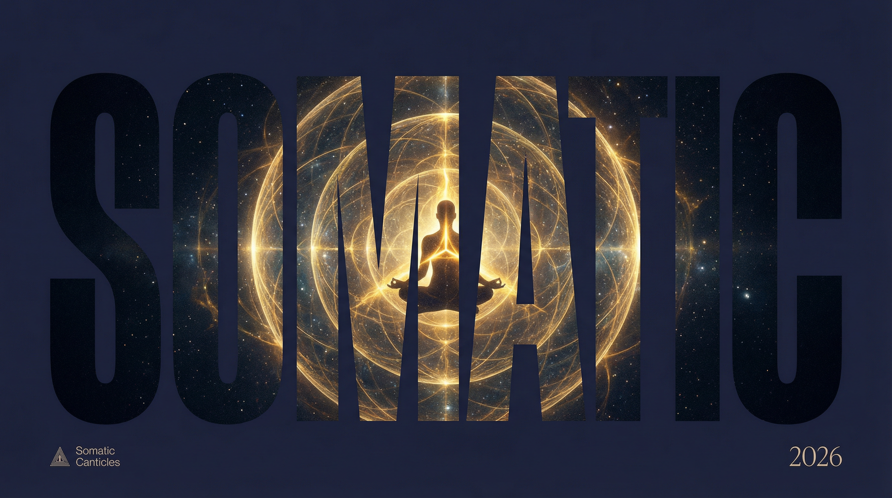

<div align="center">



</div>

---

<p align="center">


</p>

---

> What if the body was the last frontier—and freedom was learning to author it?

*Somatic Canticles* is a science-fiction trilogy that maps the hidden architecture of human consciousness through thirteen interlocking systems. Part medical thriller, part philosophical inquiry, part somatic practice—this is *The Matrix* meets *The Body Keeps the Score*.

---

## The Trilogy

| Book | Title | Theme |
|:----:|-------|-------|
| **I** | *The Anamnesis Engine* | **Diagnosis** — learning to name what governs consciousness |
| **II** | *The Myocardial Chorus* | **Integration** — learning to hold relation without collapse |
| **III** | *The Ripening* | **Liberation** — learning that freedom is authorship with responsibility |

---

## Video Trailers

*Animated from custom book covers using AI image-to-video*

<div align="center">

**Trilogy Hero**

https://github.com/Sheshiyer/somatic-canticles-v3-book-trilogy/raw/main/ASSETS/trilogy-hero--video.mp4

</div>

| Book | Trailer |
|:----:|---------|
| **Book I: The Anamnesis Engine** | https://github.com/Sheshiyer/somatic-canticles-v3-book-trilogy/raw/main/ASSETS/book1-anamnesis--video.mp4 |
| **Book II: The Myocardial Chorus** | https://github.com/Sheshiyer/somatic-canticles-v3-book-trilogy/raw/main/ASSETS/book2-myocardial--video.mp4 |
| **Book III: The Ripening** | https://github.com/Sheshiyer/somatic-canticles-v3-book-trilogy/raw/main/ASSETS/book3-ripening--video.mp4 |

*Videos also available in [ASSETS/videos/](./ASSETS/videos/) directory (curated clips) and archive for raw generations.*

A full **Phase 4 proposal** (next priorities and remaining gaps) has been created at [ASSETS/PHASE4_PROPOSAL.md](./ASSETS/PHASE4_PROPOSAL.md).

---

## Book Covers

<div align="center">

<table>
<tr>
<td width="33%" align="center">

**Book I: The Anamnesis Engine**


</td>
<td width="33%" align="center">

**Book II: The Myocardial Chorus**


</td>
<td width="33%" align="center">

**Book III: The Ripening**


</td>
</tr>
</table>

</div>

*Also available in iPhone, iPad, and Watch formats in the [ASSETS](./ASSETS/) directory.*

---

## The World

In the year 2026, humanity has mapped the final frontier—the human body itself. Thirteen systems. Thirteen engines. Thirteen keys to a consciousness that was never meant to be unlocked.

But when the protocol fails, when the **Wilt** begins to spread through the infrastructure of reality itself, a fractured team of **Somanauts**—scientists who navigate the somatic architecture—must recover what was lost.

They call it the **Anamnesis Engine**.

To activate it, they must trace consciousness back through its own evolution: from the choroid plexus that first dreamed of selfhood, through the blood-brain barrier that drew the line between inside and outside, into the myocardial chorus of the heart that beats before the brain wakes.

---

## The Stakes

This trilogy moves through three linked burdens:

- **Diagnosis**: learning to name what governs consciousness
- **Integration**: learning to hold relation without collapse  
- **Liberation**: learning that freedom is not escape from reality, but authorship with responsibility

> *"If the book works, it will not tell you what to believe. It will make certain inherited sentences harder to obey."*

---

## Structure

```
Somatic-Canticles-v2/
├── ASSETS/
│   ├── covers/                # Core book visuals (typo-mask, editorial, modular) — fully nested by book + style
│   │   ├── book-1-anamnesis/
│   │   ├── book-2-myocardial/
│   │   ├── book-3-ripening/
│   │   └── series/
│   ├── merch/                 # Product mockups (nested)
│   ├── marketing/ads/         # Social ads (nested)
│   ├── quotes/                # Quote cards (nested)
│   ├── heroes/                # Product/campaign/window heroes
│   ├── bookmarks/
│   ├── videos/                # Curated clips (merch videos standardized)
│   ├── archive/
│   │   ├── raw-videos/        # 30 unnamed generations
│   │   └── iterations/        # v1 designs + old sources
│   ├── pipeline/              # Scripts + living plans
│   ├── press-kit/, world/venues/, tarot/, trilogy/  # Supporting categories
│   └── MANIFEST.md + manifest.json + README.md   # Documentation at root (only 3 files)
├── FRONTMATTER/
│   ├── Frontmatter.md
│   └── Preface.md           # "A Reader's Note"
├── CHAPTERS/
│   ├── book_1/              # 8 chapters: The Anamnesis Engine
│   ├── book_2/              # 7 chapters: The Myocardial Chorus
│   └── book_3/              # 12 chapters: The Ripening
├── COMPILED/
│   ├── Book_1_Anamnesis_Engine.md
│   ├── Book_2_Myocardial_Chorus.md
│   ├── Book_3_The_Ripening.md
│   └── Somatic_Canticles_Trilogy_Omnibus.md
├── MARKETING/
│   └── Back_Cover_Blurb.md
└── BACKMATTER/
    ├── Glossary.md
    ├── Bibliography.md
    ├── Backmatter.md
    └── Closing_Note.md
```

---

## Word Count

| Book | Words |
|------|------:|
| Book One: The Anamnesis Engine | 120,133 |
| Book Two: The Myocardial Chorus | 108,975 |
| Book Three: The Ripening | 140,216 |
| **Total** | **369,324** |

---

## Key Themes

- **Somatic Intelligence** — the body as a knowing system
- **Inherited Pattern** — how consciousness is governed by invisible scripts
- **Structural Concealment** — what we can't see shapes what we believe
- **Witness Practice** — observing without collapsing
- **Freedom as Authorship** — rewriting the protocols of self

---

## For Readers

> *Warning: This book may alter how you feel in your body.*

Read slowly enough for the distinctions to matter—especially the late ones:
- between peace and anesthesia
- between meaning and premature closure
- between safety and diminished life
- between transcendence and a world that can actually be inhabited

---

## Contributing

This is a living manuscript. For collaborative editing, feedback, or discussion, please refer to our contributing guidelines or open an issue.

---

## License

This work is licensed under [MIT License](./LICENSE).

---

<div align="center">


*© 2026 Somatic Canticles — Written in the languages of systems, symbol, physiology, and witness practice.*

</div>